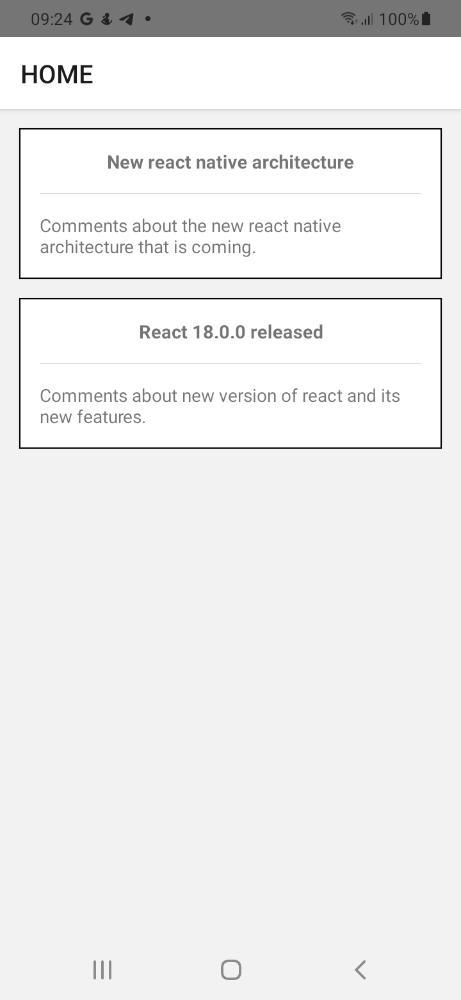
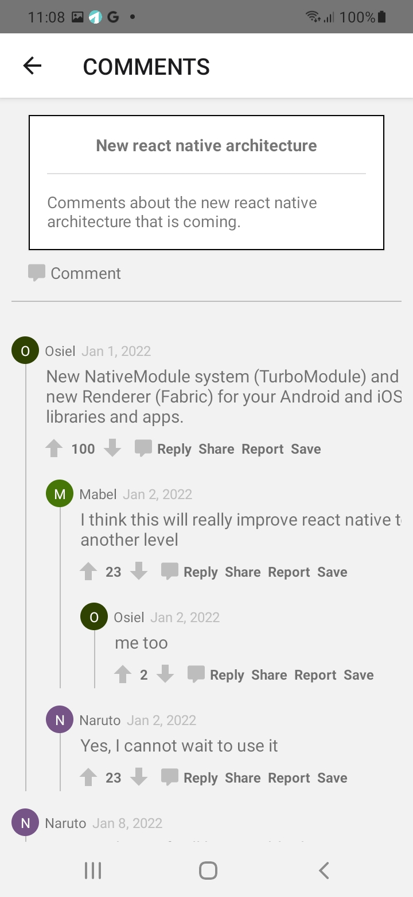
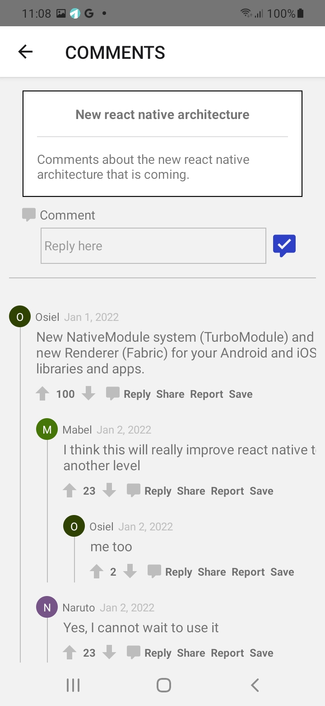
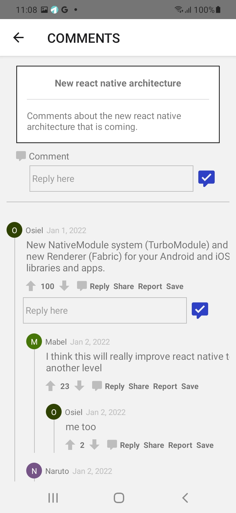
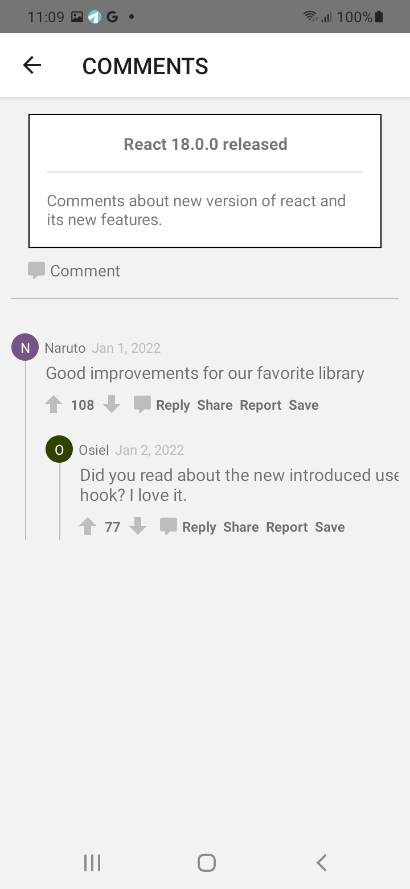
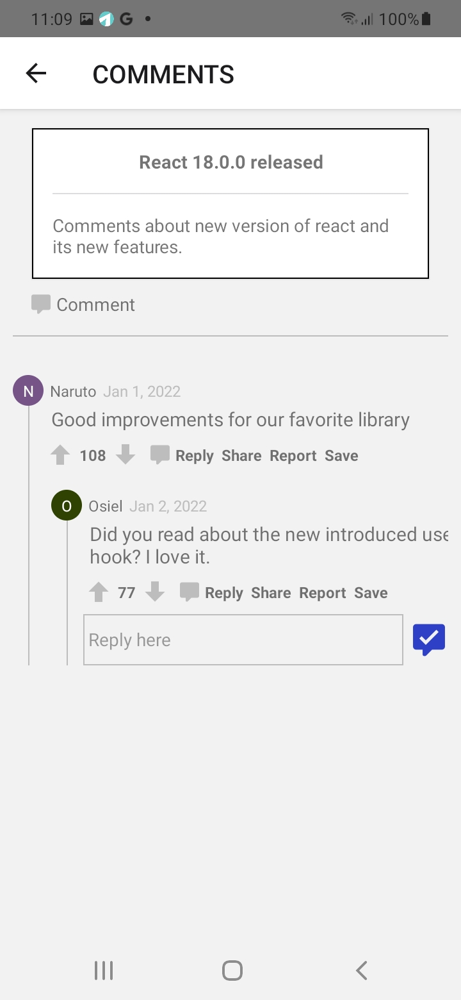
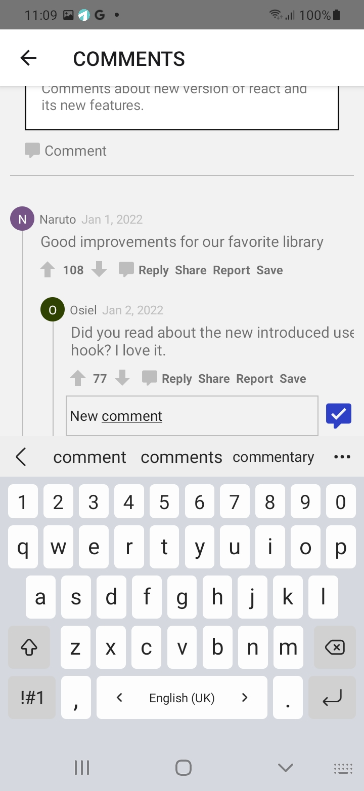
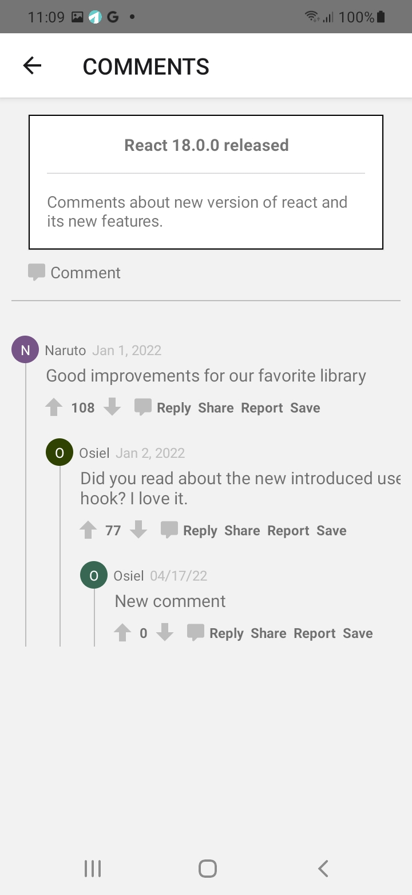

# Commentify - react native
Demo - Commentify is a react native project using Typescript

## APK included
You can find a release variant apk file included in the root of this repo. You can download it and install it on your Android device.

## How to run this project locally?
1. Environment setup:
  - Check instruction [here](https://reactnative.dev/docs/environment-setup "here")
2. Pull the project from github: [commentify](https://github.com/osielmesa/commentify.git "commentify")
3. Run `yarn install` or `npm install` in the root of the project. Depending which dependency manager you are using.
4. Start the development server: `yarn start` or `npm run start`
5. Run the project in Android: `yarn android` or `npm run android`
6. Run the project in iOS: `yarn ios` or `npm run ios`

## What is included in this solution?
- [x] Articles screen: here you can find the subjects to comment about.
- [x] Comments screen: here you can find cooments of a particular article.
- [x] Reply comment: you can reply comments.
- [x] Vote up: you can vote comments up.
- [x] Vote down: you can vote comments down.
- [x] Share comment: you can share comments using third party apps.
- [ ] Save comment: Just placeholder function is included.
- [ ] Report comment: Just placeholder function is included.
- [ ] User and author managment: the app is asuming always the same author for replies.

## Relevants technologies and techniques
1. Typescript
2. React navigation
3. Redux toolkit: store, slices, redux dev tools, creatSlice, creatAsyncThunk...
4. Built-in hooks: useEffect, useState, useCallback, from redux (useDispatch, useSelector)...
5. Custom hooks: useFetch. Also, it allows to mock API calls.
6. UI framework: react-native-elements.
7. Async storage: to save data locally in the device.
8. FlatList: for better rendering and performance.

## Improvements
- [ ] All saved data in local storage is loaded at once when Home screen is loaded: this could be improved by loading only when data is requested.
- [ ] Saving data to local storage: At the moment the app is reading the requested data, inserting on it and then saving all data back. Maybe this could be improved.
- [ ] Horizontal scrolling: Sometime the horizontal scroll is not working properly.
- [ ] Top level comments rendering: The top level comments of an article are being rendered by .map, this will render all of them even when they are not visible on the screen.
- [ ] The UI can be improved to make it more beautiful and pixel perfect.

## Screenshots
&nbsp;&nbsp;&nbsp;&nbsp;&nbsp;&nbsp;
&nbsp;&nbsp;&nbsp;&nbsp;&nbsp;&nbsp;  
&nbsp;&nbsp;&nbsp;&nbsp;&nbsp;&nbsp;
&nbsp;&nbsp;&nbsp;&nbsp;&nbsp;&nbsp;  
&nbsp;&nbsp;&nbsp;&nbsp;&nbsp;&nbsp;
&nbsp;&nbsp;&nbsp;&nbsp;&nbsp;&nbsp;  
&nbsp;&nbsp;&nbsp;&nbsp;&nbsp;&nbsp;
&nbsp;&nbsp;&nbsp;&nbsp;&nbsp;&nbsp;

## Author
**name**: Osiel Lima Díaz
**website**: [https://osiellima.com](https://osiellima.com "https://osiellima.com")
**linkedin**: [https://www.linkedin.com/in/osiel/](https://www.linkedin.com/in/osiel/ "https://www.linkedin.com/in/osiel/")
